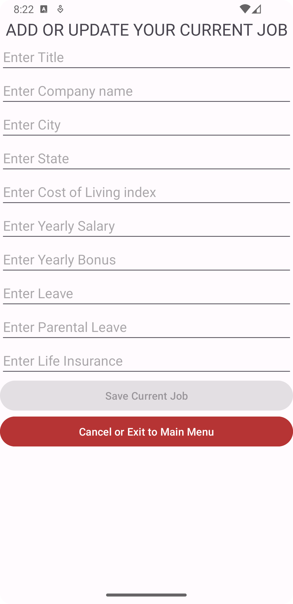
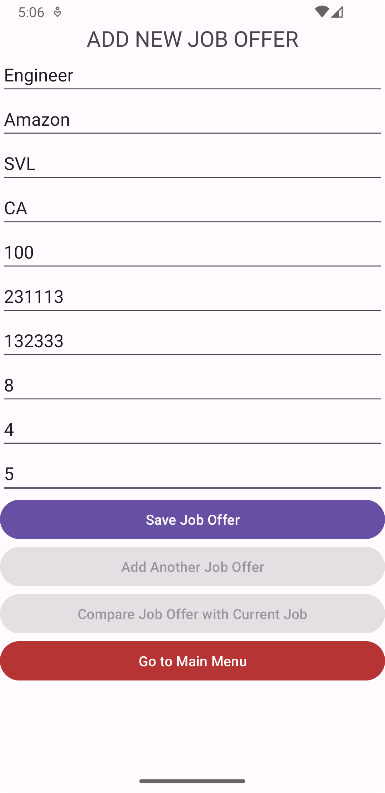
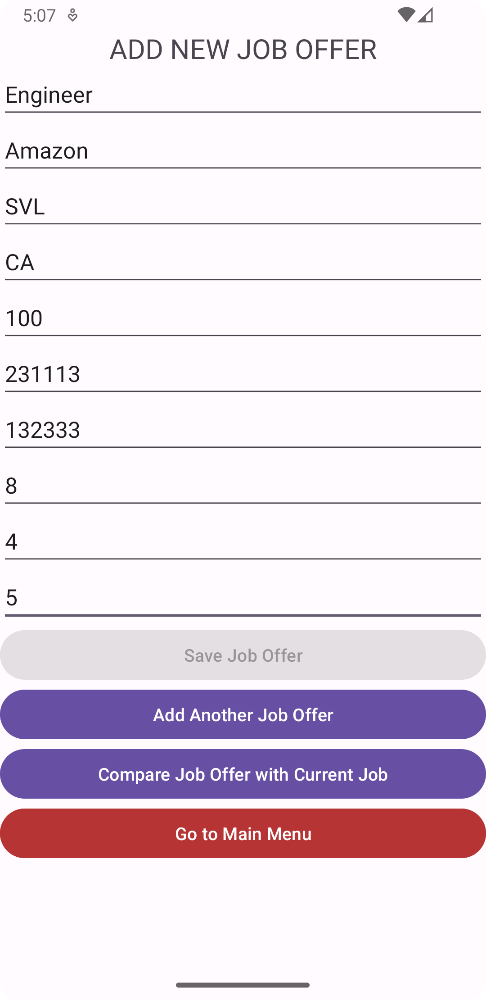
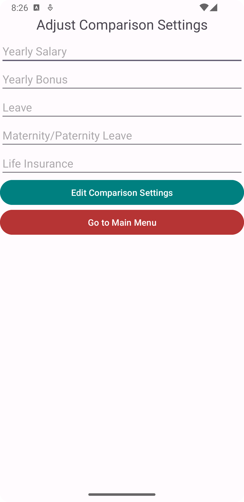
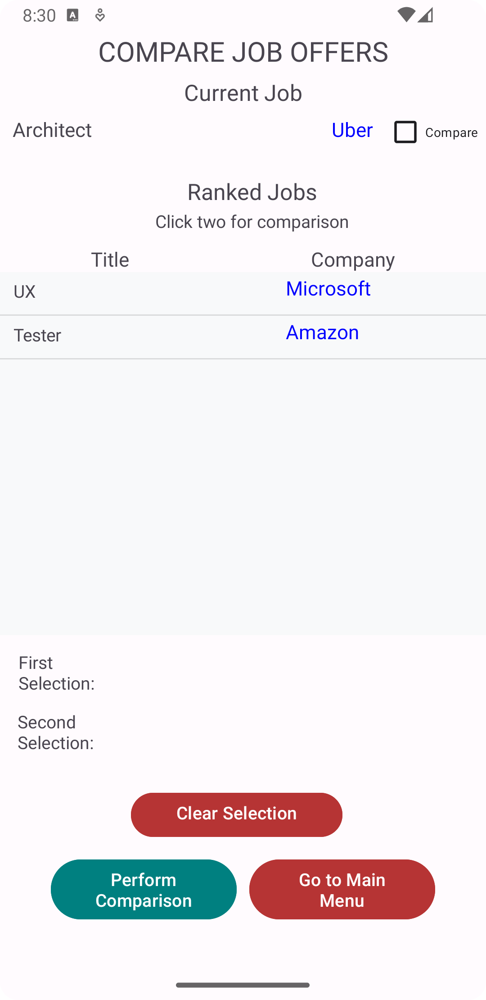
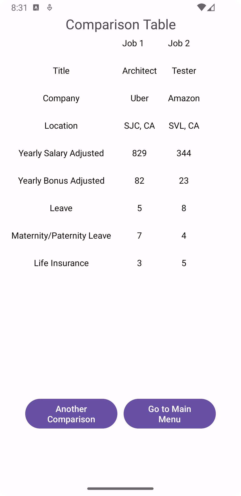

# Job Offer Comparison Application User Manual

## About the Application

The application allows to compare job offers with benefits, in different locations, and other aspects beyond salary

## Application Start

At the start of the application, the following screen appears which is the Main menu of the applications.


<p align="center">

</p>

You can

 - Enter or edit current job detail
 - Enter job offers
 - Adjust the comparison settings
 - Compare job offers

Next, the functionality of each of the above options is explained.

## Add / Update Current Job

When you click on this option, you will be shown a user interface like this

<p align="center">

</p>

Here you can enter the following details
1.  Title
2.  Company
3.  Location (entered as city and state)
4.  Overall cost of living in the location (expressed as an  [index](https://www.expatistan.com/cost-of-living/index/north-america)  )
5.  Yearly salary (as USD)
6.  Signing bonus (as USD)
7.  Yearly bonus (as USD)
8.  Retirement benefits (as percentage matched)
9.  Leave time (vacation days and holiday and/or sick leave, as a single overall number of days)

After finishing to enter the values, click on "Save Current Job" to save the current job.
This way, you can edit or add your current job.  

If you do not want to save the job details or cancel and exit, you can click on "Cancel or Exit to Main Menu". You will be taken to the Main menu.

## Add Job Offers

On the main menu, click on "Add Job Offers" to add the job offers. When you click on this option, you will be shown a user interface similar to one listed above as shown 

<p align="center">

</p>

You can save the job offer by clicking on "Save Job Offer". 

After that, you will be able to add another offer or return to the main menu or you can compare the saved offer with the current job details (if present) as shown below.

<p align="center">

</p>

## Adjust Comparison Settings

In order to adjust the comparison settings, you can assign different weights to the different attributes of the job as shown. 

<p align="center">

</p>

You can assign integer weights to
1.  Yearly salary
2.  Yearly bonus
3.  Leave
4.  Maternity/Paternity Leave
5.  Life Insurance

These weights will be used to compare different jobs. Each job will be assigned a weighted score.

The job’s score is computed as the weighted sum of:

AYS + AYB + (LT * AYS / 260) + (MPL * AYS / 260) + (LI/100 * AYS)

```
where:
AYS = yearly salary adjusted for cost of living
AYB = yearly bonus adjusted for cost of living
LT = Leave
MPL = Maternity/Paternity Leave
LI = Life Insurance
```
For example, if the weights are 3 for the yearly salary, 2 for Maternity/Paternity Leave and 1 for all other factors, the score would be computed as:
```
(3/8 * AYS) + (1/8 * AYB) + (1/8 * LT * AYS / 260) + (2/8 * MPL * AYS / 260) + (1/8* LI/100 * AYS)
```

## Compare Job Offers

Clicking on ""Compare Job Offers" will show a list of job offers, displayed as Title and Company as well as the current job displayed as Title and Company as shown.

<p align="center">

</p>

The jobs will be listed in the order of their rank from best to worst with rank being calculated as per the score mentioned above.

You can select any two jobs to compare and trigger the comparison.

After triggering the comparison, a table comparing the two jobs, displaying, for each job:

 1. Title 
 2. Company
 3. Location
 4. Yearly salary adjusted for cost of living
 5. Yearly bonus adjusted for cost of living
 6. Leave 
 7. Maternity/Paternity Leave
 8. Life Insurance

as shown.

<p align="center">

</p>

You can further perform another comparison or go back to the main menu.
